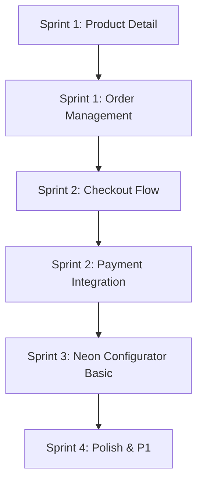

# King Neon - Sprint Plan (December 2025)

> **Based on:** `.agent/FEATURE_TRACKER.md`
> **Focus:** P0 (Critical) features for MVP

---

## Sprint 1: Product Detail & Order Management (Current)

**Duration:** 3-5 days

### Goals

1. Complete Product Detail Page (Web)
2. Implement Order Management (Admin)
3. Basic Checkout preparation

### Tasks

#### 1.1 Product Detail Page (Web) - Priority: P0

| Task                                             | Complexity | Estimated Time |
| ------------------------------------------------ | ---------- | -------------- |
| Create `/products/[slug]/page.tsx`               | Medium     | 2h             |
| Product image gallery component                  | Medium     | 1.5h           |
| Product info section (title, price, description) | Low        | 1h             |
| Size/Color selector (if applicable)              | Medium     | 1.5h           |
| Add to Cart button integration                   | Low        | 0.5h           |
| Related products section                         | Low        | 1h             |
| SEO meta tags                                    | Low        | 0.5h           |

**Files to create/modify:**

- `apps/web/src/app/products/[slug]/page.tsx` [NEW]
- `apps/web/src/components/ProductGallery/ProductGallery.tsx` [NEW]
- `apps/web/src/components/ProductInfo/ProductInfo.tsx` [NEW]
- `apps/web/src/components/RelatedProducts/RelatedProducts.tsx` [NEW]

---

#### 1.2 Order Management (Admin) - Priority: P0

| Task                                             | Complexity | Estimated Time |
| ------------------------------------------------ | ---------- | -------------- |
| Order List page                                  | Medium     | 2h             |
| Order status badges & filtering                  | Medium     | 1.5h           |
| Order Detail modal/page                          | High       | 2.5h           |
| Status update workflow                           | Medium     | 1.5h           |
| Order items display (with Custom Design preview) | High       | 2h             |

**Files to create/modify:**

- `apps/admin/src/app/orders/page.tsx` [NEW]
- `apps/admin/src/app/orders/[id]/page.tsx` [NEW]
- `apps/admin/src/components/OrderStatusBadge.tsx` [NEW]
- `apps/admin/src/components/OrderTimeline.tsx` [NEW]

---

## Sprint 2: Checkout Flow & Payment

**Duration:** 5-7 days

### Goals

1. Implement full checkout flow
2. Integrate Stripe payment
3. Order confirmation & email

### Tasks

#### 2.1 Checkout Flow (Web) - Priority: P0

| Task                                  | Complexity | Estimated Time |
| ------------------------------------- | ---------- | -------------- |
| Checkout page layout                  | Medium     | 2h             |
| Shipping address form                 | Medium     | 1.5h           |
| Order summary component               | Low        | 1h             |
| Guest checkout support                | Medium     | 1.5h           |
| Form validation (Zod/React Hook Form) | Medium     | 1.5h           |

**Files to create/modify:**

- `apps/web/src/app/checkout/page.tsx` [NEW]
- `apps/web/src/components/CheckoutForm/CheckoutForm.tsx` [NEW]
- `apps/web/src/components/OrderSummary/OrderSummary.tsx` [NEW]

#### 2.2 Payment Integration - Priority: P0

| Task                                       | Complexity | Estimated Time |
| ------------------------------------------ | ---------- | -------------- |
| Stripe setup (API)                         | High       | 3h             |
| Payment Intent creation                    | High       | 2h             |
| Stripe Elements (Web)                      | High       | 2.5h           |
| Payment confirmation handling              | Medium     | 1.5h           |
| Webhook handling (payment success/failure) | High       | 2h             |

**Files to create/modify:**

- `apps/api/src/modules/payments/` [NEW MODULE]
- `apps/web/src/components/PaymentForm/PaymentForm.tsx` [NEW]

#### 2.3 Order Confirmation - Priority: P0

| Task                           | Complexity | Estimated Time |
| ------------------------------ | ---------- | -------------- |
| Order confirmation page        | Low        | 1h             |
| Order confirmation email (API) | Medium     | 2h             |
| Order status email updates     | Medium     | 1.5h           |

---

## Sprint 3: Neon Configurator (Basic)

**Duration:** 7-10 days

### Goals

1. Build basic text-to-neon configurator
2. Real-time preview
3. Dynamic pricing

### Tasks

#### 3.1 Configurator UI (Web) - Priority: P0

| Task                         | Complexity | Estimated Time |
| ---------------------------- | ---------- | -------------- |
| Configurator page layout     | Medium     | 2h             |
| Text input component         | Low        | 1h             |
| Font selector (with preview) | High       | 3h             |
| Color picker                 | Medium     | 2h             |
| Size selector                | Medium     | 1.5h           |
| Backboard options            | Medium     | 1.5h           |

#### 3.2 Preview Engine - Priority: P0

| Task                            | Complexity | Estimated Time |
| ------------------------------- | ---------- | -------------- |
| Canvas-based preview component  | Very High  | 8h             |
| Font rendering with neon effect | High       | 4h             |
| Color application               | Medium     | 2h             |
| Size scaling                    | Medium     | 1.5h           |
| Glow/neon effect (CSS/Canvas)   | High       | 3h             |

#### 3.3 Pricing Engine - Priority: P0

| Task                              | Complexity | Estimated Time |
| --------------------------------- | ---------- | -------------- |
| Price calculation API             | Medium     | 2h             |
| Real-time price update (Frontend) | Medium     | 1.5h           |
| Price breakdown display           | Low        | 1h             |

**Files to create/modify:**

- `apps/web/src/app/create/page.tsx` [MODIFY]
- `apps/web/src/components/NeonConfigurator/` [NEW]
- `apps/web/src/components/NeonPreview/` [NEW]
- `apps/api/src/modules/neon-config/neon-config.service.ts` [MODIFY - add calculation]

---

## Sprint 4: Polish & P1 Features

**Duration:** 5-7 days

### Goals

1. Product search & filtering
2. Collections page
3. Static pages (via Strapi)

### Tasks

- Product search with Algolia/PostgreSQL FTS
- Collection pages with filtering
- About, FAQ, Contact pages (Strapi integration)
- Email templates refinement

---

## Recommended Execution Order

---

## Immediate Next Actions

### Option A: Focus on Web (Customer-facing)

1. Product Detail Page
2. Checkout Flow
3. Payment Integration

### Option B: Focus on Admin (Operations)

1. Order Management
2. Order Detail with Custom Design preview
3. Neon Config options CRUD

### Option C: Parallel Development

- **Developer 1:** Product Detail + Checkout
- **Developer 2:** Order Management + Admin features

---

## Technical Debt to Address

| Item                              | Priority | Notes       |
| --------------------------------- | -------- | ----------- |
| Replace `` with `next/image` | Low      | Performance |
| Add loading skeletons             | Medium   | UX          |
| Error boundary components         | Medium   | Reliability |
| API response caching              | Low      | Performance |
| Unit tests                        | Low      | Quality     |

---

## Decision Required

**Which sprint focus do you want to start with?**

1. **Product Detail Page** → Customer can view individual products
2. **Order Management (Admin)** → You can process incoming orders
3. **Checkout Flow** → Complete end-to-end purchase

_Recommend: Start with #1 (Product Detail) since it's needed before checkout can work._
