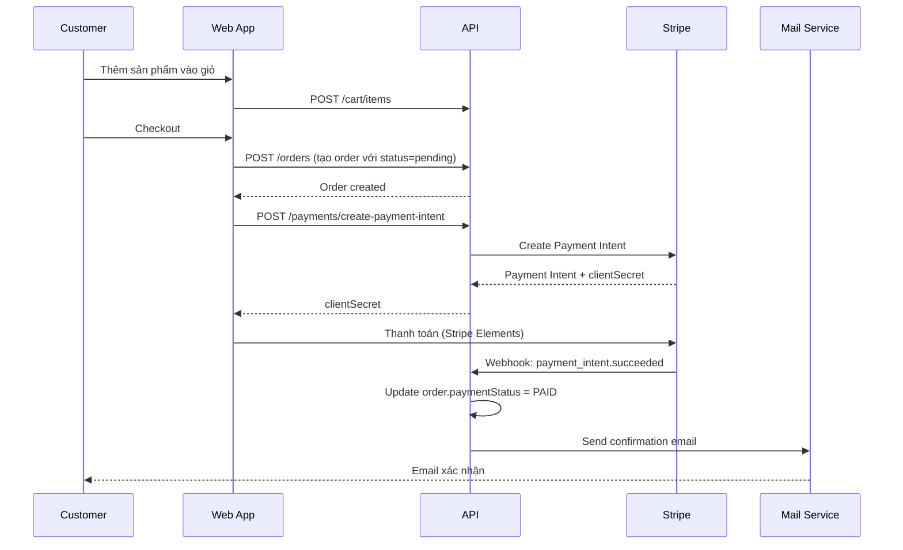

# King Neon - Tài Liệu Nghiệp Vụ Dự Án

> **Mục đích**: Tài liệu này dành cho các AI Agent khác đọc để hiểu nghiệp vụ dự án mà không cần đọc toàn bộ source code. Cập nhật lần cuối: 2025-12-23.

---

## 1. Tổng Quan Dự Án

**King Neon** là một nền tảng E-commerce bán biển quảng cáo LED Neon tùy chỉnh, lấy cảm hứng từ [Kings Of Neon](https://kingsofneon.com).

### Đặc điểm chính:

- **Sản phẩm có sẵn**: Catalog các thiết kế LED Neon sẵn có để khách hàng mua
- **Tùy chỉnh thiết kế**: Khách hàng có thể tạo biển Neon với text tùy ý, chọn font, màu sắc, kích thước
- **Yêu cầu báo giá**: Hỗ trợ khách hàng B2B gửi yêu cầu báo giá cho đơn hàng số lượng lớn/tùy chỉnh đặc biệt

---

## 2. Kiến Trúc Hệ Thống

### Tech Stack

| Layer       | Technology              | Port (Dev)                 |
| ----------- | ----------------------- | -------------------------- |
| Frontend    | Next.js 15 + TypeScript | 3000                       |
| Admin       | Next.js 15 + TypeScript | 3001                       |
| Backend API | NestJS + TypeScript     | 4000                       |
| Database    | PostgreSQL 16           | 5434                       |
| Cache       | Redis 7                 | 6380                       |
| Storage     | MinIO                   | 9002 (API), 9003 (Console) |

### Cấu Trúc Monorepo

```
king-neon/
├── apps/
│   ├── web/        # Website công khai cho khách hàng
│   ├── admin/      # Admin panel quản lý
│   └── api/        # Backend API (NestJS)
├── packages/
│   ├── shared/     # Shared types & utilities
│   └── ui/         # Shared UI components
└── docker-compose.yml
```

---

## 3. Database Schema & Entities

### 3.1 User (Người dùng)

**Table**: `users`

| Field        | Type      | Mô tả                                              |
| ------------ | --------- | -------------------------------------------------- |
| id           | UUID (PK) | ID người dùng                                      |
| email        | string    | Email (unique)                                     |
| passwordHash | string    | Mật khẩu đã hash (bcrypt)                          |
| name         | string    | Tên đầy đủ                                         |
| phone        | string?   | Số điện thoại                                      |
| address      | JSONB?    | Địa chỉ (street, city, state, postalCode, country) |
| role         | enum      | `customer` hoặc `admin`                            |
| isActive     | boolean   | Trạng thái hoạt động                               |

**Quan hệ**:

- 1:N với `Order`
- 1:N với `Quote`
- 1:N với `CustomDesign`

### 3.2 Product (Sản phẩm)

**Table**: `products`

| Field         | Type       | Mô tả                            |
| ------------- | ---------- | -------------------------------- |
| id            | UUID (PK)  | ID sản phẩm                      |
| name          | string     | Tên sản phẩm                     |
| slug          | string     | URL-friendly slug (unique)       |
| description   | text       | Mô tả chi tiết                   |
| basePrice     | decimal    | Giá cơ bản (USD)                 |
| categoryId    | UUID (FK)? | Liên kết đến Category            |
| isCustom      | boolean    | Có phải sản phẩm tùy chỉnh không |
| options       | JSONB?     | Các tùy chọn bổ sung             |
| active        | boolean    | Đang active hay không            |
| images        | string[]   | Danh sách image keys (MinIO)     |
| featuredImage | string?    | Ảnh đại diện                     |

### 3.3 Category (Danh mục)

**Table**: `categories`

| Field       | Type      | Mô tả             |
| ----------- | --------- | ----------------- |
| id          | UUID (PK) | ID danh mục       |
| name        | string    | Tên danh mục      |
| slug        | string    | URL slug (unique) |
| description | text?     | Mô tả             |
| isActive    | boolean   | Trạng thái active |

### 3.4 Cart & CartItem (Giỏ hàng)

**Cart** (Table: `carts`):

- `id`, `userId`, `sessionId` (cho guest carts trong tương lai)

**CartItem** (Table: `cart_items`):

| Field       | Type      | Mô tả                                    |
| ----------- | --------- | ---------------------------------------- |
| id          | UUID (PK) | ID item                                  |
| cartId      | UUID (FK) | Liên kết đến Cart                        |
| productId   | UUID      | ID sản phẩm (hoặc custom design)         |
| productName | string    | Tên sản phẩm snapshot                    |
| price       | decimal   | Giá snapshot tại thời điểm add to cart   |
| quantity    | integer   | Số lượng                                 |
| image       | string?   | Ảnh sản phẩm                             |
| type        | enum      | `product` hoặc `custom`                  |
| options     | JSONB?    | Tùy chọn (size, color, custom config...) |

### 3.5 Order & OrderItem (Đơn hàng)

**Order** (Table: `orders`):

| Field                 | Type       | Mô tả                                                                     |
| --------------------- | ---------- | ------------------------------------------------------------------------- |
| id                    | UUID (PK)  | ID đơn hàng                                                               |
| orderNumber           | string     | Mã đơn hàng (unique, hiển thị cho khách)                                  |
| userId                | UUID (FK)  | Người đặt hàng                                                            |
| status                | enum       | `pending`, `confirmed`, `processing`, `shipped`, `delivered`, `cancelled` |
| subtotal              | decimal    | Tổng tiền hàng                                                            |
| shipping              | decimal    | Phí ship                                                                  |
| tax                   | decimal    | Thuế                                                                      |
| total                 | decimal    | Tổng cộng                                                                 |
| shippingAddress       | JSONB      | Địa chỉ giao hàng                                                         |
| billingAddress        | JSONB?     | Địa chỉ thanh toán                                                        |
| customerEmail         | string?    | Email khách hàng                                                          |
| customerName          | string?    | Tên khách hàng                                                            |
| customerPhone         | string?    | SĐT khách hàng                                                            |
| stripePaymentIntentId | string?    | Stripe Payment Intent ID                                                  |
| paymentStatus         | enum       | `pending`, `paid`, `failed`, `refunded`                                   |
| paidAt                | timestamp? | Thời điểm thanh toán thành công                                           |
| notes                 | text?      | Ghi chú                                                                   |

**OrderItem** (Table: `order_items`):

- Snapshot thông tin sản phẩm/custom design tại thời điểm đặt hàng
- Có thể liên kết với `Product` hoặc `CustomDesign`

### 3.6 Quote (Yêu cầu báo giá)

**Table**: `quotes`

| Field        | Type       | Mô tả                                                    |
| ------------ | ---------- | -------------------------------------------------------- |
| id           | UUID (PK)  | ID báo giá                                               |
| userId       | UUID (FK)? | Người yêu cầu (có thể null nếu guest)                    |
| companyName  | string     | Tên công ty                                              |
| contactName  | string     | Tên người liên hệ                                        |
| email        | string     | Email liên hệ                                            |
| phone        | string?    | Số điện thoại                                            |
| requirements | text       | Mô tả yêu cầu                                            |
| attachments  | string[]?  | Danh sách file đính kèm                                  |
| status       | enum       | `pending`, `reviewing`, `quoted`, `accepted`, `rejected` |
| adminNotes   | text?      | Ghi chú của admin                                        |
| quotedPrice  | decimal?   | Giá báo                                                  |
| respondedAt  | timestamp? | Thời điểm phản hồi                                       |

### 3.7 Custom Design (Thiết kế tùy chỉnh)

**Table**: `custom_designs`

| Field           | Type       | Mô tả                        |
| --------------- | ---------- | ---------------------------- |
| id              | UUID (PK)  | ID thiết kế                  |
| userId          | UUID (FK)? | Người tạo                    |
| textLines       | string[]   | Các dòng text trên biển Neon |
| fontId          | UUID (FK)  | Font chữ đã chọn             |
| colorId         | UUID (FK)  | Màu LED đã chọn              |
| sizeId          | UUID (FK)  | Kích thước đã chọn           |
| materialId      | UUID (FK)  | Chất liệu LED                |
| backboardId     | UUID (FK)  | Loại bảng nền                |
| backboardColor  | string?    | Màu bảng nền                 |
| calculatedPrice | decimal    | Giá tính tự động             |
| previewImageUrl | string?    | URL ảnh preview              |

### 3.8 Neon Configuration Entities

Các tùy chọn để tạo Custom Design:

| Entity            | Table                 | Mô tả                        |
| ----------------- | --------------------- | ---------------------------- |
| NeonFont          | `neon_fonts`          | Font chữ có sẵn              |
| NeonColor         | `neon_colors`         | Màu LED (có mã hex)          |
| NeonSize          | `neon_sizes`          | Kích thước (cm) và hệ số giá |
| NeonMaterial      | `neon_materials`      | Chất liệu LED                |
| NeonBackboard     | `neon_backboards`     | Loại bảng nền                |
| PreviewBackground | `preview_backgrounds` | Ảnh nền preview              |

---

## 4. API Modules & Endpoints

### 4.1 Auth Module (`/api/auth`)

| Method | Endpoint  | Mô tả                           | Auth Required |
| ------ | --------- | ------------------------------- | ------------- |
| POST   | /register | Đăng ký tài khoản mới           | No            |
| POST   | /login    | Đăng nhập (trả về JWT + cookie) | No            |
| POST   | /logout   | Đăng xuất (xóa cookie)          | No            |
| GET    | /me       | Lấy thông tin user hiện tại     | Yes           |

**Rate limiting**: 5 requests/minute cho register và login.

**Authentication**:

- JWT Bearer Token trong header
- HTTP-only cookie (`auth_token`) được set khi login/register

### 4.2 Products Module (`/api/products`)

| Method | Endpoint                | Mô tả                                                | Auth  |
| ------ | ----------------------- | ---------------------------------------------------- | ----- |
| GET    | /                       | Lấy danh sách sản phẩm (có filter, sort, pagination) | No    |
| GET    | /featured               | Lấy sản phẩm nổi bật                                 | No    |
| GET    | /categories-with-counts | Lấy categories kèm số lượng SP                       | No    |
| GET    | /slug/:slug             | Lấy sản phẩm theo slug                               | No    |
| GET    | /:id                    | Lấy sản phẩm theo ID                                 | No    |
| POST   | /                       | Tạo sản phẩm mới                                     | Admin |
| PATCH  | /:id                    | Cập nhật sản phẩm                                    | Admin |
| DELETE | /:id                    | Xóa sản phẩm                                         | Admin |

**Query params cho GET /**:

- `categoryId`: Filter theo category
- `search`: Tìm kiếm theo tên
- `page`, `limit`: Pagination
- `sortBy`: `price-asc`, `price-desc`, `name-asc`, `name-desc`, `newest`
- `activeOnly`: Chỉ lấy sản phẩm active

### 4.3 Categories Module (`/api/categories`)

| Method | Endpoint            | Mô tả                          | Auth  |
| ------ | ------------------- | ------------------------------ | ----- |
| GET    | /                   | Lấy tất cả categories          | No    |
| GET    | /active             | Chỉ lấy categories active      | No    |
| GET    | /:id                | Lấy category theo ID           | No    |
| GET    | /slug/:slug         | Lấy category theo slug         | No    |
| GET    | /:id/products/count | Đếm số sản phẩm trong category | No    |
| POST   | /                   | Tạo category mới               | Admin |
| PATCH  | /:id                | Cập nhật category              | Admin |
| DELETE | /:id                | Xóa category                   | Admin |

### 4.4 Cart Module (`/api/cart`)

_Yêu cầu JWT authentication cho tất cả endpoints_

| Method | Endpoint       | Mô tả                          |
| ------ | -------------- | ------------------------------ |
| GET    | /              | Lấy giỏ hàng của user hiện tại |
| POST   | /items         | Thêm sản phẩm vào giỏ          |
| PATCH  | /items/:itemId | Cập nhật số lượng item         |
| DELETE | /items/:itemId | Xóa item khỏi giỏ              |
| DELETE | /              | Xóa toàn bộ giỏ hàng           |
| POST   | /merge         | Merge guest cart sau khi login |

### 4.5 Orders Module (`/api/orders`)

| Method | Endpoint            | Mô tả                          | Auth  |
| ------ | ------------------- | ------------------------------ | ----- |
| POST   | /                   | Tạo đơn hàng mới               | User  |
| GET    | /                   | Lấy tất cả đơn hàng (admin)    | Admin |
| GET    | /my-orders          | Lấy đơn hàng của user hiện tại | User  |
| GET    | /track/:orderNumber | Theo dõi đơn hàng (public)     | No    |
| GET    | /:id                | Lấy chi tiết đơn hàng          | User  |
| PATCH  | /:id                | Cập nhật đơn hàng              | Admin |
| POST   | /:id/cancel         | Hủy đơn hàng                   | User  |

**Order Status Flow**:

```
pending → confirmed → processing → shipped → delivered
                                           ↘ cancelled
```

### 4.6 Payments Module (`/api/payments`)

| Method | Endpoint               | Mô tả                       |
| ------ | ---------------------- | --------------------------- |
| POST   | /create-payment-intent | Tạo Stripe Payment Intent   |
| POST   | /webhook               | Xử lý Stripe webhook events |

**Webhook events được xử lý**:

- `payment_intent.succeeded`: Cập nhật order thành PAID, gửi email xác nhận
- `payment_intent.payment_failed`: Cập nhật order thành FAILED

### 4.7 Quotes Module (`/api/quotes`)

| Method | Endpoint   | Mô tả                         | Auth  |
| ------ | ---------- | ----------------------------- | ----- |
| POST   | /          | Gửi yêu cầu báo giá           | No    |
| GET    | /          | Lấy tất cả yêu cầu báo giá    | Admin |
| GET    | /my-quotes | Lấy báo giá của user hiện tại | User  |
| GET    | /:id       | Lấy chi tiết báo giá          | No    |
| PATCH  | /:id       | Cập nhật báo giá (phản hồi)   | Admin |

**Rate limiting**: 3 requests/minute cho POST.

### 4.8 Neon Config Module (`/api/neon`)

| Method            | Endpoint      | Mô tả                     | Auth  |
| ----------------- | ------------- | ------------------------- | ----- |
| GET               | /config       | Lấy tất cả config options | No    |
| GET               | /fonts        | Lấy danh sách fonts       | No    |
| GET               | /colors       | Lấy danh sách màu         | No    |
| GET               | /sizes        | Lấy danh sách kích thước  | No    |
| GET               | /materials    | Lấy danh sách chất liệu   | No    |
| GET               | /backboards   | Lấy danh sách bảng nền    | No    |
| POST/PATCH/DELETE | /[entity]/:id | CRUD operations           | Admin |

### 4.9 Upload Module (`/api/upload`)

Xử lý upload file lên MinIO storage.

### 4.10 Mail Module

Gửi email thông qua SMTP (không có REST endpoints công khai):

- **Order Confirmation**: Gửi cho khách hàng khi thanh toán thành công
- **Admin Notification**: Thông báo cho admin về đơn hàng mới

---

## 5. Frontend Applications

### 5.1 Web App (`apps/web`) - Port 3000

Website công khai dành cho khách hàng:

| Route              | Mô tả                                     |
| ------------------ | ----------------------------------------- |
| `/`                | Trang chủ với sản phẩm nổi bật            |
| `/collections`     | Danh sách sản phẩm, lọc theo category     |
| `/products/:slug`  | Chi tiết sản phẩm                         |
| `/create`          | Tạo biển Neon tùy chỉnh (2D configurator) |
| `/create-v2`       | Tạo biển Neon tùy chỉnh (3D configurator) |
| `/checkout`        | Thanh toán                                |
| `/account`         | Quản lý tài khoản, lịch sử đơn hàng       |
| `/about`           | Giới thiệu công ty                        |
| `/(auth)/login`    | Đăng nhập                                 |
| `/(auth)/register` | Đăng ký                                   |

### 5.2 Admin App (`apps/admin`) - Port 3001

Panel quản trị:

| Route                  | Mô tả                   |
| ---------------------- | ----------------------- |
| `/`                    | Dashboard tổng quan     |
| `/login`               | Đăng nhập admin         |
| `/products`            | Quản lý sản phẩm        |
| `/products/create`     | Tạo sản phẩm mới        |
| `/categories`          | Quản lý danh mục        |
| `/orders`              | Quản lý đơn hàng        |
| `/customers`           | Quản lý khách hàng      |
| `/preview-backgrounds` | Quản lý ảnh nền preview |

---

## 6. Business Logic quan trọng

### 6.1 Luồng Đặt Hàng (Order Flow)



### 6.2 Tính Giá Custom Design

Giá của Custom Design được tính dựa trên:

1. **Size**: Có hệ số nhân giá (`priceMultiplier`)
2. **Material**: Có giá cộng thêm (`basePrice`)
3. **Backboard**: Có giá cộng thêm
4. **Độ dài text**: Có thể ảnh hưởng đến giá

### 6.3 Role-Based Access Control (RBAC)

| Role     | Quyền hạn                                           |
| -------- | --------------------------------------------------- |
| customer | Xem sản phẩm, đặt hàng, quản lý account của mình    |
| admin    | Toàn quyền: CRUD products, orders, categories, etc. |

Guards được sử dụng:

- `JwtAuthGuard`: Xác thực JWT token
- `RolesGuard` + `@Roles(UserRole.ADMIN)`: Kiểm tra role admin

### 6.4 Image Storage

- Tất cả images được lưu trên **MinIO** (S3-compatible)
- Images được reference bằng **key** trong database
- API trả về URLs đã được transform (thêm MinIO endpoint)

---

## 7. Environment Variables quan trọng

```bash
# Database
DATABASE_HOST, DATABASE_PORT, DATABASE_USERNAME, DATABASE_PASSWORD, DATABASE_NAME

# Redis Cache
REDIS_HOST, REDIS_PORT

# MinIO Storage
MINIO_ENDPOINT, MINIO_ROOT_USER, MINIO_ROOT_PASSWORD, MINIO_BUCKET

# Stripe Payments
STRIPE_SECRET_KEY, STRIPE_WEBHOOK_SECRET

# JWT
JWT_SECRET, JWT_EXPIRATION

# Email
SMTP_HOST, SMTP_PORT, SMTP_USER, SMTP_PASS, MAIL_FROM
```

---

## 8. Rate Limiting & Security

- **Throttling**:
  - Auth endpoints: 5 req/min
  - Quote creation: 3 req/min
- **Password hashing**: bcrypt
- **XSS Protection**: Input validation với class-validator
- **CORS**: Configured cho frontend domains
- **Cookie Security**:
  - `httpOnly: true`
  - `secure: true` (production)
  - `sameSite: 'lax'`

---

## 9. Lưu ý khi Phát triển

1. **TypeORM Entities**: Sử dụng decorators để define schema, migrations được generate tự động
2. **DTO Validation**: Sử dụng `class-validator` decorators cho input validation
3. **Image URLs**: Backend lưu keys, frontend nhận URLs đã transform
4. **Payments**: Webhook là nguồn tin cậy duy nhất cho payment status, không tin client-side success
5. **Idempotency**: Webhook handlers kiểm tra trạng thái hiện tại trước khi update để tránh duplicate processing

---

_Tài liệu này được tạo tự động và nên được cập nhật khi có thay đổi nghiệp vụ._
